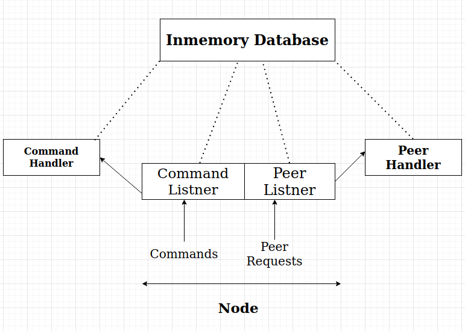

# Pastry (Distributed Hash Table)

Pastry, a scalable,
distributed object location and routing system for wide-area peer-to-peer applications. Pastry is completely decentralized, scalable, and self-organizing; it automatically
adapts to the arrival, departure and failure of nodes.

It is an overlay network and routing network for the implementation of a distributed hash table (DHT). 
The key-value pairs are stored in a redundant peer-to-peer network of connected Internet hosts. 
The protocol is bootstrapped by supplying it with the IP address of a peer already in the network and from then on via the routing table 
which is dynamically built and repaired. Because of its redundant and decentralized nature there is no single point of 
failure and any single node can leave the network at any time without warning and with little or no chance of data loss.

It can route a request to the right node in less than
log 2 b (N) steps. b is typically 4.
Delivery is guaranteed unless L/2 nodes with adjacent
nodeIds fail simultaneously. L = 16 or 32.
## Arcitecture:

## Node Structure:

1. IP Address (IPv4 String)
2. Port(String)
3. Node ID(String): md5 hash value of IP+Port
4. Leaf Set(Pair<Set,Set>): Set of Nodes closest to the current node in terms of NodeID
5. Routing Table(vector): Nodes in the ith row have i length prefix match with the current NodeID
6. Neighbourhood Set(Set): Set of Nodes closest to the current node in terms of Proximity

## Inmemory Database:
for Each node, inmemory database will store nearest key-value pair of global hash table.
1. mytable
2. mytable2
3. keyhashtable

## Routing Algorithm:
Route ( Destination node):

1. Check if the destination node is within the range of the leafsets.
2. If yes then we can reach the destination in one hop.
3. Suppose ‘p’ is the length of the matched prefix between destination node and current node. Also let ‘i’ be the pth value in destination node id.
4. Check if, entry for pth row and ith column is not NULL.
5. If it is not NULL then route to it. Check in the union of routing table, leaf set and neighbour set. Choose the most suitable node. Then route to it.

## Entry of a new node X and updating it's state table:
X sends its joining request to A using proximity metric.Now, A uses routing algorithm to route this request to respective node and forwards its State Table to X.
Similarly, all preceding nodes (B,C,D) will accept the request and will forward their corresponding state tables to X. Using these intermedate updates from respective nodes,
X will update it's State Table entries.

## Repair Algorithm:
If some of the pastry nodes leave the network then we need to repair state tables of remaining nodes.
### Leaf set Repair:
1. For Left Leaf set, we will ask for the leaf entries from the leftmost leaf. If we will find an entry that’s NodeId is less than ours. We will insert it in left leaf set.
2. If no relevant entry is found. Then the same procedure is repeated with the next node from the previously selected node.
3. For Right Leaf set same procedure is followed except that rightmost leaf is called first.
### Routing Table Update:

1. Suppose R[p][i] is the entry which is needed to be repaired. The algorithm will ask for the R[p][i] entries from nodes R[p][j] for all j!=i.
2. If no relevant entries are found than it will ask from next row and follows the same procedure until a relevant entry is found

## User Commands:
    - port <port_No>It will take LANs IP.
    - join <IP> <Port> Give the ip and port of the pastry node through which you want to join
    - put <Key> <Value>It will store the value against the given key
    - get <Key>It will retrieve the value stored against the key
    - "quit" Gracefully closes the pastry node
    - "shutdown" Shut Down the whole pastry Network
    - "print" This will print the routing table of current pastry node
